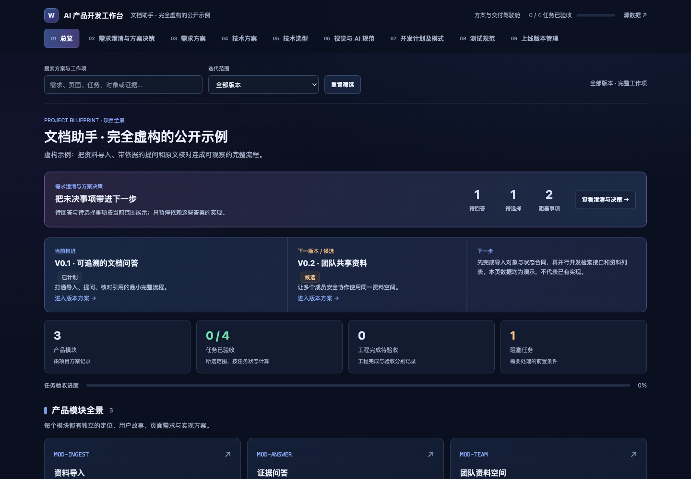

# AI 产品开发工作台

把模糊想法变成有方案、有取舍、有验收依据的产品迭代。一个可安装的 AI Coding skill，配套可浏览的工作台、结构化记录与校验工具。

[使用文章](docs/article/article.md) · [完整示例](examples/document-assistant/) · [Skill 协议](skills/ai-dev-workbench/SKILL.md) · [发行包](https://github.com/wanghui2323/ai-product-workbench/releases) · [MIT](LICENSE)

当你说“帮我做个文档助手”，AI 应先弄清谁用、在哪个场景用、做到什么程度才算有效；给出可比较的方案，记录你的选择，再把选择落实到需求、技术、开发、测试和版本交付中。这个项目把这套协作方式做成可复用的 skill，调用名为 `$ai-dev-workbench`。



> 截图与随包示例使用虚构的文档助手。示例中的验证记录是教学数据，不代表实际业务已经开发或上线。

## 先试起来

运行环境：Python 3.10+。生成、校验和安装只用标准库；工作台 HTML 不依赖远程脚本或 API key。AI 对话由你正在使用的 Coding Agent 提供。

```bash
git clone https://github.com/wanghui2323/ai-product-workbench.git
cd ai-product-workbench
python3 scripts/install.py
```

默认安装到 `$CODEX_HOME/skills/ai-dev-workbench`，未设置 `CODEX_HOME` 时使用 `~/.codex/skills/ai-dev-workbench`。已有相同内容时不重复安装；已有不同内容时停止并保留原文件。需要更新时可显式使用 `--replace-with-backup`，或用 `--dest /path/to/ai-dev-workbench` 安装到其他目录。旧版完整保存在技能扫描根外的 `skill-backups` 目录（默认 `~/.codex/skill-backups`），终端会输出实际位置；备份不会自动删除。

在 Codex 新会话中调用：

```text
使用 $ai-dev-workbench，为这个项目建立 AI 产品开发工作台。
先读取现有需求、代码、项目规则和版本事实。
需求不清楚时先问关键问题，提供 2–3 个可比较的方案，
再把我明确选择的方案落实到需求、技术、计划、测试和版本中。
```

如果工具没有发现新安装的 skill，可以直接让它读取安装目录的 `SKILL.md`。其他 Agent 也可以显式读取这个文件；各工具的自动发现和安装目录需要分别配置。

## 看一个完整工作台

```bash
python3 scripts/verify.py
python3 -m http.server 8765 --bind 127.0.0.1
```

打开 [文档助手示例](http://127.0.0.1:8765/examples/document-assistant/docs/workbench/index.html)，查看总览、澄清与方案决策，以及七个管理域。静态 HTML 也可在本地直接打开，HTTP 预览更便于浏览关联文件。

| 管理域 | 需要回答的问题 |
|---|---|
| 需求方案 | 谁在什么场景遇到什么问题，范围与验收是什么？ |
| 技术方案 | 模块、对象、接口和数据流怎样支持用户行为？ |
| 上线版本管理 | 本版交付什么，在哪个环境验证，如何回滚？ |
| 视觉交互 AI 规范 | 页面与组件如何表现，加载、失败、纠错如何处理？ |
| 技术选型方案 | 为什么选它，替代方案、代价和变更条件是什么？ |
| 开发计划及模式 | 为什么按这个顺序做，哪些可以并行，何时退出？ |
| 测试规范 | 怎样证明行为满足要求，失败时保留哪些证据？ |

需求变化时，沿稳定 ID 追到受影响的方案、任务、测试和版本。只暂停依赖未决问题的工作，其余工作可以继续。已有 `SPEC`、`ADR` 或项目工作台的项目，先沿用原来的事实来源，不强制迁移全部文档。

## 它如何运行

```text
AI 对话：读项目事实 → 澄清问题 → 比较方案 → 记录用户明确选择
                                 ↓
项目记录：需求 / 技术 / 计划 / 测试 / 决策 / 证据 / 版本
                                 ↓ 校验并生成
工作台：浏览、搜索、下钻、草拟回答、复制给 AI、查看版本依据
```

网页上的选择和补充是临时草稿，复制后交给 AI；AI 依据用户明确回答更新源文件，再重新生成页面。网页目前没有内置模型调用、保存服务或多人实时同步。推荐项、点击和等待超时都不能自动变成用户决策。

对含 AI 能力的产品，协议还要求说明不用 AI 的基线、自动化边界、人工纠错、失败回退，以及模型、Prompt、工具、知识源和评测版本。项目记录可以链接现有实验报告；本项目不提供模型服务或实验运行平台。

## 在自己的项目生成

以下命令从本仓库根目录运行，把 `/path/to/project` 换成实际项目路径。`init` 仅创建待填充的骨架；真实内容应由 AI 结合项目事实写入。

```bash
python3 skills/ai-dev-workbench/scripts/workbench.py init \
  --project-root /path/to/project --name "我的产品" --purpose "用户与核心目标"

# 编辑项目中的 docs/workbench/workbench.json，然后校验与构建。
python3 skills/ai-dev-workbench/scripts/workbench.py validate \
  --project-root /path/to/project \
  --data /path/to/project/docs/workbench/workbench.json --check-links

python3 skills/ai-dev-workbench/scripts/workbench.py build \
  --project-root /path/to/project \
  --data /path/to/project/docs/workbench/workbench.json
```

源文件是 `workbench.json`，生成入口是同目录的 `index.html`，版本页在 `versions/`。不要直接编辑生成 HTML。`init` 拒绝覆盖已有源文件；`build` 只替换带本工具生成标记的页面，不执行记录里的命令、提交 Git 或部署产品。

## 验证范围

校验器检查字段结构、ID 关联、依赖环、未决问题的影响范围、证据绑定和状态约束。`--check-links` 检查项目内文件链接，不验证远程网站或证据内容的真实性。

`done` 表示实现完成；`accepted` 需要退出条件对应的证据。`local_verified` 只记录本地验证；`released` 需要目标交付与环境验证依据。通过工具校验不能替代人工核对、真实服务测试或业务验收。

仓库 CI 在 Python 3.10 和 3.12 上运行框架回归、安装测试及示例构建。可用 `python3 scripts/verify.py` 重跑；最新发行的实际验证结果见 [变更记录](CHANGELOG.md)。

## 项目结构与参与

```text
skills/ai-dev-workbench/   可独立安装的 skill、模板、合同、生成与校验器
examples/document-assistant/  虚构但完整的教学示例
scripts/                  安装、验证、发行打包
tests/                    分发与安装回归
docs/article/             中文文章、可编辑配图、预览与复制工作台
```

设计参考了 [Google PAIR](https://pair.withgoogle.com/chapter/user-needs/) 的用户问题与 AI 价值分析、[Microsoft](https://learn.microsoft.com/en-us/microsoft-copilot-studio/guidance/cux-disambiguate-intent) 的意图澄清，以及 [Anthropic](https://www.anthropic.com/engineering/demystifying-evals-for-ai-agents) 的 Agent 评测方法。它们是方法参考，不代表官方关联或背书。具体取舍见 [方法与依据](skills/ai-dev-workbench/references/ai-product-method.md)。

欢迎用具体的模糊需求、断开的状态关联或可复现的问题发起 Issue。提交规则见 [CONTRIBUTING.md](CONTRIBUTING.md)。本项目以 MIT 许可证发布。
