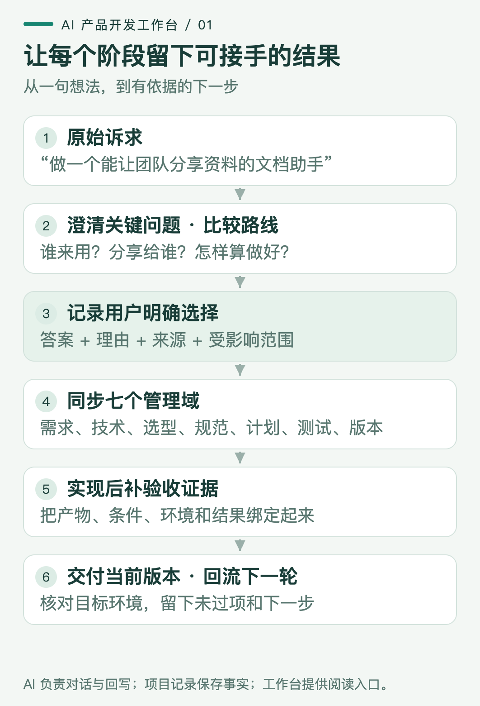
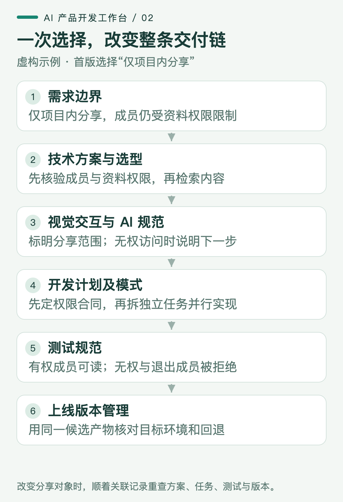
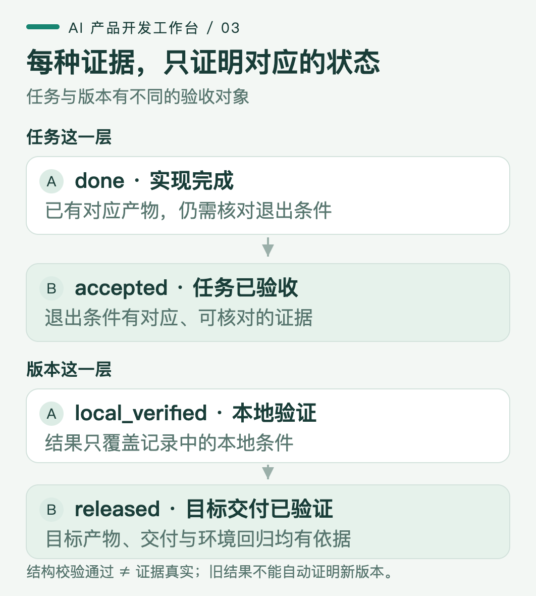

# 把模糊想法变成可验收的产品：AI 产品开发工作台

你让 AI 做一个文档助手：“团队随时能问资料，最好还能把答案分享给客户。”它很快做出上传、提问、回答和分享按钮。你把链接发给同事，对方却打不开引用；换个账号，又看到了原本无权访问的内容。

问题出在哪里？“可以分享”这四个字里，藏着接收人、资料权限、引用可见性和失效后的处理方式。界面实现了一个动作，产品要兑现的结果却没有被说清。

这是一个虚构的教学场景，后文的对话与方案都用来解释机制，不代表真实用户访谈或已上线产品。它也对应产品经理和 AI builder 经常要做的判断：哪些信息足够开始开发，哪些选择必须让用户作出，最后拿什么证明东西真的能用？

我把这套协作方式整理成了 **AI 产品开发工作台**，准备以可安装的 skill 形式开源。Skill 是供 Coding Agent 读取的工作协议，配合项目记录、校验工具和网页视图，让 AI 接手时知道先读什么、该问什么、选择之后改哪里、完成以后留什么证据。

这套工作方式的主线可以顺着一个需求走到底。

*图 1：对话产生理解与决策，项目记录保留关系和依据，视图让人检查当前状态。*

面对开头的请求，我希望 AI 先停在几个真正会改变方案的问题上：

1. **谁能看到什么？** 首版给你个人、项目成员，还是外部客户使用？资料是否已经有访问限制？
2. **先解决哪一种找资料的任务？** 给一个典型问题，再说明目前怎样找、什么结果算找到，才能建立比较基线。
3. **缺少依据时怎么办？** 应补问、显示未找到，还是交给人处理？这决定答案承诺和失败路径。

问题不在于把访谈问卷问全，而在于找出当前实现依赖的答案。Microsoft 的意图澄清文档也把提问和提供选项用于缩小歧义；每轮通常控制在一到三个关键问题，是这套工作台的交互约定，并非官方规定的固定数量。[Microsoft：澄清用户意图](https://learn.microsoft.com/en-us/microsoft-copilot-studio/guidance/cux-disambiguate-intent)

“目前怎样找”尤其容易被忽略。如果现有文档目录和搜索已经能快速找到原文，生成一段更顺滑的文字未必增加价值。我们应比较用户完成同一任务的过程：能否找到正确依据、减少多少人工核对、失败时能否继续。Google PAIR 建议先理解现有工作流，并判断 AI 相对规则等方案能增加什么独特价值。[Google PAIR：用户需要与成功定义](https://pair.withgoogle.com/chapter/user-needs/)

在答案还不充分时，可以先把差异最大的路线摆出来。以这个文档助手为例，真正不同的不是按钮多少，而是谁参与、系统承担什么责任。

| 候选路线 | 适合先验证什么 | 必须付出的代价 |
|---|---|---|
| 个人资料助手 | 一个人能否从自己的资料得到有依据的答案 | 暂时不能验证协作价值 |
| 项目内分享 | 同事能否共同使用答案，并回到自己有权访问的原文 | 需要成员、资料权限与分享访问的一致性 |
| 外部客户分享 | 客户能否自助获取允许对外的信息 | 要重新定义对外内容、访问方式、撤回与维护责任 |

如果当前目标是团队协作，而且已有项目资料范围，我会推荐先验证项目内分享。它能检验协作价值，也能把外部访问的额外分歧留到后续。推荐的前提应写在桌面上；用户也可以自由回答、组合路线，或者先用一个案例比较，暂时不选择。

继续这个虚构场景，用户明确回复：“首版只给项目成员用，成员只能看到自己有权访问的资料。答案可以在项目内分享并查看引用，客户外链以后再议。”

**从这一刻起，系统才获得了一项可以落实的产品决策。** 工作台把原话、来源、日期和所选范围记录下来，将它关联到分享需求。外部客户的渠道仍然未定，不会因为推荐列表里有这一项，就自动进入已选范围。

这种关联要用稳定的标识保留。例如，一个分享需求关联哪些任务、哪些用例和哪个版本，即使标题后来改了，也能沿原来的关系追过去。只有文档标题和一串勾选框，AI 下次接手时很难判断“分享完成”到底对应哪次讨论。

接下来才进入七个管理域。它们分别保存同一项决策带来的不同后果。

*图 2：判断是否同步完成，要看受影响的行为与验收是否一起改变。*

在**需求方案**里，“支持分享”要变成可观察的用户行为：项目成员打开答案后，能查看有权访问的内容与引用；无权限或引用失效时，得到明确结果。于是验收对象从“按钮能生成链接”变成“正确的人获得正确内容”。

这会直接改变**技术方案**。系统需要区分提问者、项目、文档、答案和引用。检索开始前，后端按身份与资料权限确定可用范围；模型据此生成答案，答案保存所依据的文档标识和版本。接收者打开分享时，还要检查他当时的访问权限，不能把提问者的权限直接借给接收者。

这里的关键机制是两次边界检查：生成时限制输入，访问时限制输出。文档权限后来撤回，旧答案里的内容也可能不再适合展示。在这条教学方案中，可以先把相关答案标为不可访问并说明原因，再讨论是否需要部分遮蔽。仅在提示词里写“不要泄露”，无法替代后端的身份判断与数据过滤。

有了这些约束，**技术选型方案**才有讨论基础。若任务是从固定资料中回答问题，可以先比较现有搜索、检索后生成和更复杂的自主执行流程。先用相同问题检查依据是否准确、引用是否可用，再分别观察时延和费用。即使换一个生成能力更强的模型，也不会自动补上成员权限和引用管理。

**视觉交互 AI 规范**则要让用户看懂系统正在做什么。生成中的回答、已经保存的答案、待核查的引用和不可访问的内容，需要不同状态。分享入口应让人知道接收范围；失败时能返回原问题、补充资料或寻求帮助。把这些状态写进页面合同，AI 改页面时才有明确的行为依据，而不只是颜色与间距。

**开发计划及模式**要按依赖排顺序。先约定身份、文档与答案之间的接口和状态，再实现检索范围、引用记录与访问校验；随后走通提问到分享的完整流程。接口合同稳定后，页面和服务可以分工并行；多人或多个 Agent 同时改一套尚未确定的对象定义，只会放大不一致。

未决问题也有范围。客户外链没决定，可以暂停依赖外链的设计；项目内资料解析、引用定位等已确定且独立的工作仍可继续。反过来，如果“同事是否有权看这些资料”还没答案，相关分享需求就不应被标为已确认或进入实现。工作台中的阻塞关系由此控制具体任务，而不是把整个项目锁住。

到了**测试规范**，用例必须保留前面作出的选择。除了正常提问，还应检查：接收者没有权限、成员退出项目、原文删除、资料不足以支持答案。答案写得通顺但引用错了，是失败；接口返回成功但无权用户仍能读到内容，同样是失败。

这也解释了为什么需要区分模型输出与最终结果。Anthropic 的 Agent 评测方法明确区分执行记录与环境中的最终状态：模型宣称任务完成，并不能代替结果核查。对文档助手，除了读回答文本，还要实际检查权限、引用和接收者看到的页面。[Anthropic：理解 Agent 评测](https://www.anthropic.com/engineering/demystifying-evals-for-ai-agents)

最后，**上线版本管理**要能回答“交付的是刚才测过的哪一套东西”。包含 AI 能力时，只保存代码版本还不够，还要能追到模型标识、提示词、工具配置、知识源或索引，以及所用评测集。LangSmith 将一次实验描述为某个应用版本在一个数据集上的评估结果；这个对应关系让版本比较有共同基础。[LangSmith：评测概念](https://docs.langchain.com/langsmith/evaluation-concepts)

工作台可以链接已有配置与报告，不要求项目为了填表再接一套实验平台。对这个示例，发布记录应能回到那次权限与引用检查；如果临发布前更换了知识索引，旧报告是否仍适用就需要重新判断。一次接口通过记录，也不能扩写成整个产品已经验收。

**状态是一种有范围的结论，证据决定这个结论能说到哪里。**

*图 3：实现、退出条件验证、本地检查与目标环境交付，证明的是不同层次的事实。*

任务写完了，可以记为 `done`，意思是实现完成。要记为 `accepted`，还需要与该任务退出条件相匹配的证据。比如分享任务的报告，至少能说明用哪个身份、打开哪个答案、权限条件是什么，以及实际看到了什么。另一条上传接口的报告不能拿来替它通过。

版本的 `local_verified` 说明本地约定检查通过。要声明 `released`，还需有目标交付和目标环境验证依据。页面在开发者电脑上能打开，不代表另一位项目成员在目标环境中能完成同一条流程。这些状态也不能串成一个对象的统一进度条：任务验收和版本交付各有自己的范围。

如果新检查发现越权，应追加失败证据，并回退受影响的状态，保留之前的记录。这样才能回答：旧检查漏了什么，是访问路径改变、权限条件变化，还是实现退化？工作台校验器可以检查证据是否存在、版本是否匹配、状态是否矛盾；它无法读懂所有报告并保证结论真实，AI 和人仍需核对原始结果。

你可能会问：这些事情，普通 Markdown 也能记，为什么还要做成 skill？

当然可以。关键是把协作要求变成下一次会话能继续执行的协议：先读现有项目规则和事实，再澄清方向；记录明确选择，更新它影响的对象；实现之后回写证据；需要交付时检查退出条件。已有 SPEC、ADR 或工作台的项目可以继续使用原入口，不需要先搬进一套新格式。

随包生成器提供一种具体实现：AI 或人维护 `workbench.json`，它用结构化文本保存关联和状态；Python 工具先检查字段、引用、依赖及证据，再生成网页。网页负责浏览、搜索、下钻和草拟回答。每个状态只保留一处可编辑来源，避免正文说待验证、卡片却显示完成。

**当前网页没有内置 AI 服务或保存服务。** 你在页面填写回答、选择方案后，可以复制给正在协作的 AI；只有收到你的明确回答，AI 才回写项目记录并重新生成页面。页面上的推荐、点击、等待超时，都不会自动成为用户决策。需要网页直接对话、保存或多人同步的项目，还要另建服务层。

计划公开的仓库是 [wanghui2323/ai-product-workbench](https://github.com/wanghui2323/ai-product-workbench)，目标发行版本为 `v0.2.0`。当前处于发布核验阶段，公开访问与正式发行状态仍待确认。源码包中已提供独立 skill、生成器、安装脚本和虚构文档助手示例。

取得源码后，在仓库根目录运行 `python3 scripts/install.py`，即可将 skill 安装到 Codex 的 skills 目录；未设置 `CODEX_HOME` 时，路径为 `~/.codex/skills/ai-dev-workbench`。在新的 Codex 会话中用 `$ai-dev-workbench` 调用；其他 Agent 也可以显式读取它的 `SKILL.md`，自动发现方式依各工具配置。安装流程与更新选项以仓库 README 为准。

第一次使用，可以直接交给 AI 一段具体要求：

> 使用 $ai-dev-workbench 为这个项目建立工作台。先读取现有需求、代码和版本事实；需求不清楚时问关键问题并比较方案。把我明确选择的路线落实到相关方案、任务和验收条件，保留尚未决定的内容。

开始时不用追求把七个页面全部填满。选一个正在推进的需求，让 AI 沿着它回答四件事：**这是谁明确选择的？因此哪些行为改变？哪些任务现在可以做？什么证据允许我们进入下一状态？** 如果其中一项追不到，先修复那条关系。这样，下一轮开发才有一个可以共同判断、可以继续接手的起点。
