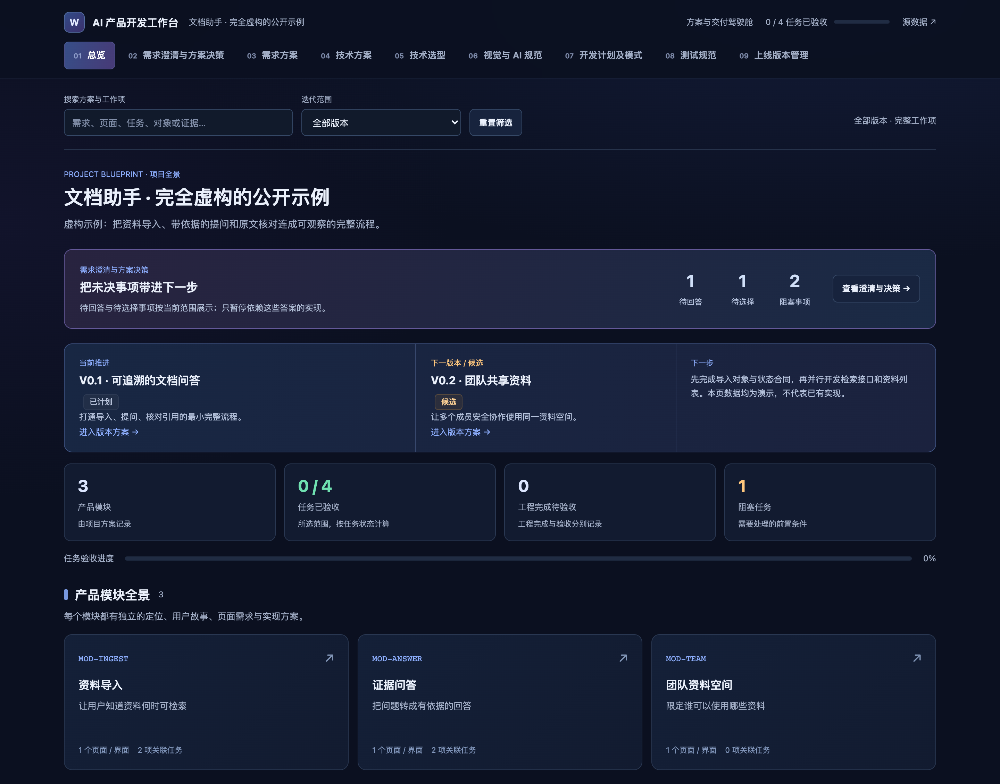
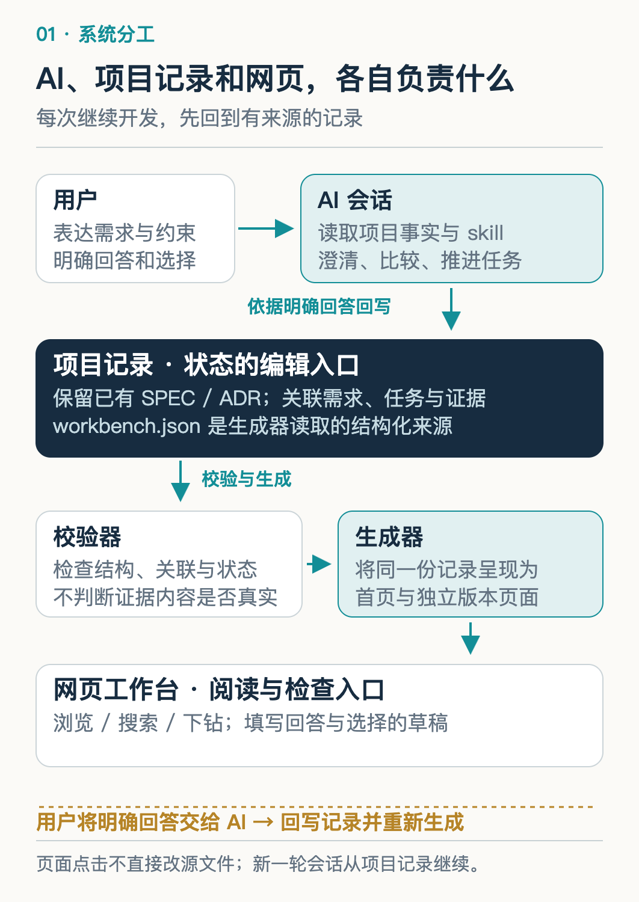
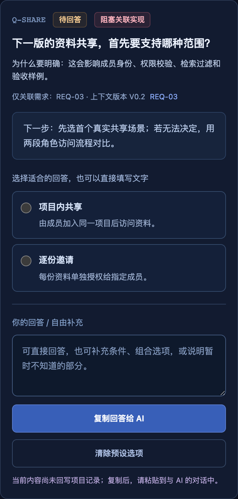
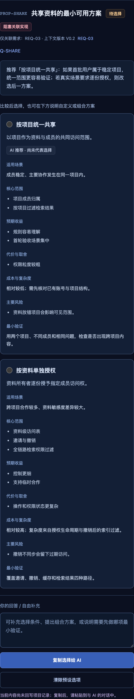
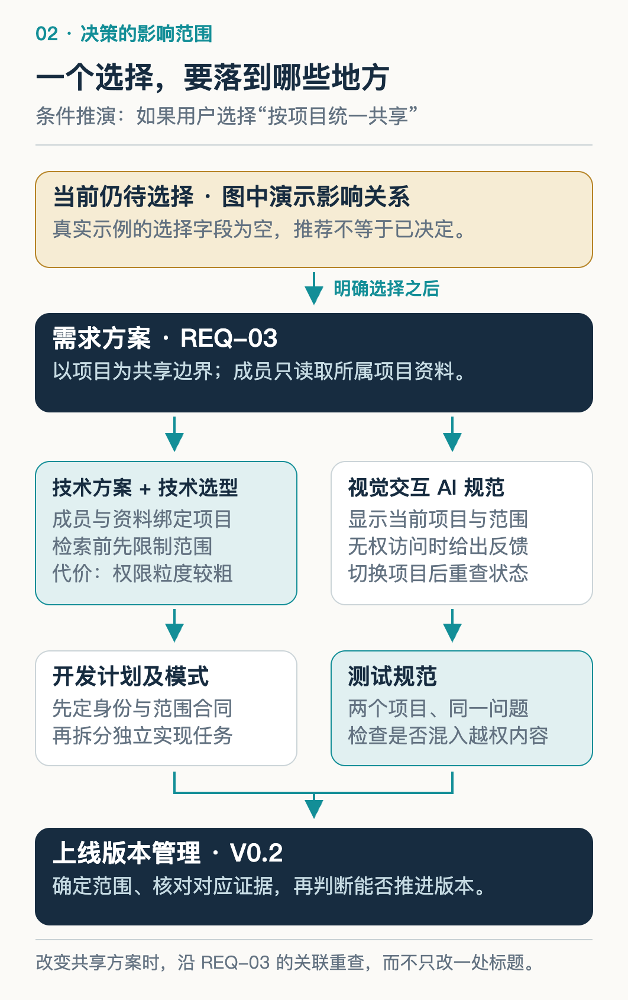
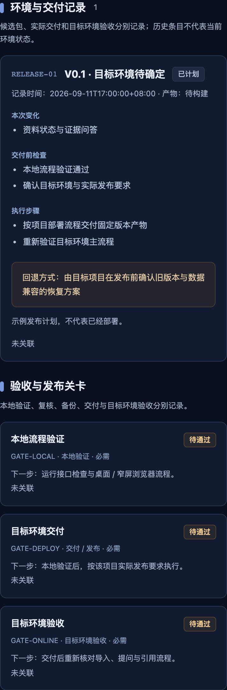

# 我把 AI 产品开发工作台开源了：从模糊需求到可验收的产品

> AI 可以很快写出代码，但需求为什么这样定、哪些工作能开始、完成以后拿什么验收，仍需要一条清楚的协作流程。这次开源，我把这条流程做成了可安装的 skill 和可以查看的工作台。

用 AI 开发产品时，需求、方案和代码会不断变化。上一轮说的是“先做个人使用”，下一轮开始讨论团队协作；页面已经能打开，刷新后状态却还没保存。聊天记录里都有解释，接手时仍得重新确认：现在究竟定了什么，下一步从哪里开始？

这套工作方式来自我在 LearnBuddy 中整理需求、方案和版本的需要。我把其中可以跨项目复用的部分整理成了 **AI 产品开发工作台**，以 MIT 许可证开源。它把需求澄清、方案选择、开发任务和验收证据连起来，让人和 AI 沿着同一套记录继续推进。

下面直接打开仓库中的文档助手示例，看看它如何工作。截图来自真实运行的工作台；里面的文档助手业务是虚构教学数据，尚未开发或验收。读完后，你应该能沿一个需求找到它的决策依据、实现依赖和完成条件，并在自己的项目里试一次。

## 一、先看全貌：对话、记录和网页怎样配合

示例的目标是让项目成员导入资料、提问，并核对回答的原文依据。总览里，V0.1 计划完成导入、问答和引用核对，V0.2 候选方向是团队共享；当前没有已上线版本，也没有验收证据。



*工作台已经可以浏览，示例业务仍处在计划阶段。总览同时展示当前工作与尚未解决的问题。*

理解这个产品，先分清三个部分的职责。

**AI 对话负责理解和推进。** 它读取项目规则、已有需求和代码事实，发现歧义时提问，给出方案；获得明确选择后，再更新受影响的记录，按用户授权继续工作。

**项目记录负责保留事实和关系。** 谁提出需求、什么问题尚未回答、任务依赖什么、报告证明哪个版本，都应能追溯。随包实现使用 `workbench.json` 保存这些关联；已有 SPEC、ADR 的项目也可以沿用原入口。

**网页负责让人检查和操作这些信息。** 你可以浏览、搜索、下钻到需求与版本，草拟问题回答或方案选择，再复制给 AI。当前网页没有内置模型调用、保存服务或多人实时同步。



*AI 根据明确回答更新源文件，校验工具检查关系，再生成可阅读的页面。*

这条更新路径很具体：AI 或人编辑源文件，Python 工具检查字段、引用、依赖和状态约束，通过后重新生成网页。直接在网页上点选，不会改写 JSON；页面也不会在等待一段时间后替用户作决定。每个状态只保留一处可编辑来源，下一轮才不会同时看到“待验证”和“已完成”。

## 二、需求澄清：先问会改变下一步的问题

示例的原始诉求是：“我想做一个团队文档助手，能问资料里的问题，之后也许让大家共享。”其中，“问资料”已经可以形成最小流程，“大家共享”还没有足够明确的访问范围。

工作台因此保留了一个问题：**下一版的资料共享，首先要支持哪种范围？** 两个选项分别是“项目内共享”和“逐份邀请”。前者由成员加入项目后访问资料，后者给每份资料单独指定可访问的人。



*问题 Q-SHARE 关联共享需求 REQ-03 和候选版本 V0.2；截图中的选项尚未成为用户答案。*

为什么先问它？因为答案会改变成员身份、授权对象、检索过滤和验收场景。若实际协作经常跨项目，直接按项目实现，后面就可能重做权限模型。每轮通常问一到三个关键问题，是这套 skill 的协作约定；重点是说明答案影响什么，并允许用户自由回答。提问和提供选项都可以帮助缩小歧义。[Microsoft：意图澄清](https://learn.microsoft.com/en-us/microsoft-copilot-studio/guidance/cux-disambiguate-intent)

这里还需要一个基线：用户目前怎样找资料，为什么已有搜索不够？示例明确保留“关键词搜索和直接阅读原文”作为对照。生成得更流畅，未必就减少了查找和核对的时间。Google PAIR 也建议先理解现有工作流，再判断 AI 能提供什么额外价值。[Google PAIR：用户需要与成功定义](https://pair.withgoogle.com/chapter/user-needs/)

问题未解决，不意味着所有工作停下。Q-SHARE 只影响 V0.2 的共享需求；V0.1 已确定的资料状态和引用合同仍可推进。**阻塞要落到它真正影响的范围，计划才不会变成“等所有问题问完再开始”。**

## 三、方案选择：推荐之后，还差一个明确决策

问题让用户说清需要，方案则让用户看见实现这个需要的代价。示例中的“共享资料的最小可用方案”比较两条路线。

“**按项目统一共享**”适合成员稳定、主要在同一项目里协作的情况。资料和成员共享项目边界，规则容易理解，首轮验收集中；代价是权限粒度较粗，资料放错项目可能影响可见范围。

“**按资料单独授权**”适合跨项目临时合作。每份资料可以独立邀请、撤销访问，控制更细；同时要处理更多权限状态，并保证撤销后，检索和缓存都不再返回无权内容。



*PROP-SHARE 当前推荐“按项目统一共享”，但两个方案都没有被选中。推荐带前提，选择仍等待用户。*

两条路线的最小验证也不同：前者可以用两个项目、不同成员和同一个问题，检查是否出现跨项目资料；后者需要覆盖邀请、撤销、缓存和检索结果。比较方案时，把验证方式一并写出，才知道怎样检验“更简单”“更灵活”这些判断。

当前推荐依赖一个尚未验证的假设：首批用户在固定项目内协作。因此工作台保留推荐理由，也保留未决状态。如果用户暂时无法选择，AI 可以先帮助走查两段角色访问流程，而不要求用户凭空确定架构。

等用户明确回答后，AI 才记录原意、来源、日期和作用范围，并关联问题与方案。选项 ID 用来保持稳定关系，不代替自然语言的决策理由。用户也可以提出新方案；推荐、网页点击和超时都不能算作已确认选择。

## 四、七域同步：一项选择会怎样改变产品方案

需求被确认之后，工作台需要把它落实到七个管理域。这里先沿 V0.1 已排期的“导入后知道资料是否可用”需求看一遍，再看共享决策会改变哪里。

**需求方案先定义可观察的结果。** REQ-01 的验收包括上传、解析、可检索和失败状态，以及刷新后一致、失败可重试。它把“支持上传”展开成了用户下一步能否继续提问的条件。

**技术方案解释这些行为由谁支撑。** 示例提出 `Document → ParseJob → Chunk → AnswerEvidence`：文档产生处理任务，完成解析后形成可检索片段，回答携带原文依据。处理状态由服务端持久记录，前端刷新后重新读取；上传请求结束，不能直接把文档标成可检索。这是待实现的对象合同，工作台本身没有提供文档解析服务。

**技术选型方案记录为何这样选。** 示例的状态存储仍是 proposed，候选包括本地文件和关系数据库。文件方案运行依赖少，但要处理并发写入；数据库方便事务管理，也增加部署和维护工作。需要结合现有项目、并发和恢复要求作选择，而不是由工作台默认替每个项目选同一种技术栈。

**视觉交互 AI 规范把真实状态变成用户能理解的反馈。** 示例要求任务状态条展示待开始、执行中、完成和失败可重试；耗时未知时不编造百分比。页面对象、状态矩阵和恢复入口先说清，AI 实现时才知道刷新、空态和错误分别应显示什么，设计规范也就不只是一组颜色。

**开发计划及模式根据依赖排顺序。** 当前先做 TASK-01“导入对象与状态合同”；合同稳定后，TASK-02“检索与引用接口”和 TASK-03“资料列表与处理反馈”才能并行；两者完成后再进入 TASK-04 的全流程验收。是否使用多个 Agent，取决于接口和文件责任能否分开。

**测试规范把前面的承诺变成检查动作。** 示例已经写出“导入资料→处理期间刷新→重读状态”的关键路径，预期是同一个任务仍可查，不能重复创建。规范只是预期；执行时还要记录实际环境、输入、结果和失败恢复情况。

**上线版本管理规定这一轮交付到哪里。** V0.1 收入导入、单人资料检索、引用与失败恢复，将多人共享、批量导出和复杂 OCR 列为非目标。发布计划需要进一步确定产物、目标环境、发布前检查与回滚方式，才能知道什么叫本版交付完成。



*一项决定需要落实到受影响的行为、对象、计划、检查和版本边界。*

如果后续明确选择“按项目统一共享”，共享需求就要写清项目边界，技术方案补成员归属与访问过滤，交互显示当前范围，计划增加相应实现，测试加入跨项目隔离，版本冻结交付范围。这些是选择后的联动方向，**当前示例尚未作出该选择，也没有完成这些业务能力**。

七域不要求每次修改都重写七份文档。一次文案修订可能只影响页面；一次权限决策会影响更多对象。稳定关联的作用，就是帮助 AI 找到应改的范围，并留下未受本轮结论覆盖的内容。

## 五、执行与证据：什么允许任务进入下一状态

当 AI 汇报“已完成”，首先要确认它完成了哪一层。代码和页面已经实现，可以记录为 `done`；任务达到 `accepted`，还需要与退出条件匹配的证据。

例如，TASK-03 要求处理期间刷新后恢复真实状态。只有上传接口返回成功，无法证明这个条件；需要实际导入、刷新、重新读取同一任务，并检查页面状态。一张截图也只能证明截图中可见的结果，不能单独证明刷新或撤销流程已经走通。

模型的执行记录和环境中的最终结果需要分别检查。Anthropic 的 Agent 评测方法区分 transcript 与 outcome；这种区分同样适用于开发协作中的完成汇报。[Anthropic：理解 Agent 评测](https://www.anthropic.com/engineering/demystifying-evals-for-ai-agents)



*示例的 V0.1 是 planned，V0.2 是 candidate，证据列表为空；这些页面展示交付计划，不代表文档助手已经上线。*

版本的 `local_verified` 说明约定的本地检查通过，`released` 还需目标交付和目标环境验证依据。任务验收与版本发布属于不同对象，不能串成一个统一进度条。另一版本的报告，也不能直接替当前版本通过。

产品包含 AI 能力时，还要关联被测的模型、Prompt、工具、知识源和评测版本。否则索引已经换了，报告仍可能描述旧结果。LangSmith 把实验对应到某个应用版本与数据集，这个关系也可以用现有配置文件和报告保留，不必为了工作台接入新的评测平台。[LangSmith：评测概念](https://docs.langchain.com/langsmith/evaluation-concepts)

发现新失败后，应追加记录、回退受影响状态，再修复和复测。校验工具能检查证据是否被绑定、版本是否匹配、状态是否矛盾；报告内容是否真实、业务行为是否达标，仍需人和 AI 核对原始结果。

## 六、做成 skill：让下一次项目也能继续这套流程

一个工作台文件能记录这次项目，skill 则把读取与更新的方法带到下一次协作。新需求进来，先读原始诉求与当前范围；开始开发，先读任务依赖和规范；准备交付，再回到退出条件、产物与环境证据。

因此，可复用的部分是工作协议、记录合同、生成器和校验器。具体业务角色、模块数量、技术栈和发布流程由项目填充。新项目可以从空骨架开始，已有项目则优先沿用 SPEC、ADR 和工作台，不要求为使用工具先搬完全部文档。

开源仓库是 [wanghui2323/ai-product-workbench](https://github.com/wanghui2323/ai-product-workbench)，已发布版本为 `v0.2.0`。它包含独立 skill、安装脚本、生成与校验工具，以及本文展示的完整示例。当前网页支持浏览和草拟回复；需要网页直接对话、保存或多人同步时，还要实现相应服务层。

这套协议也不会把“整理工作台”自动扩展成业务开发。用户要求开发时，AI 才在已有授权内实现、验证并回写。工具生成一页计划，与计划中的产品已经完成，是两件需要分别交付的工作。

## 七、动手试一次：改一个需求，检查关联有没有跟着变

准备 Python 3.10 或以上版本，在终端取得仓库并安装：

```bash
git clone https://github.com/wanghui2323/ai-product-workbench.git
cd ai-product-workbench
python3 scripts/install.py
python3 scripts/verify.py
python3 -m http.server 8765 --bind 127.0.0.1
```

安装默认使用 `$CODEX_HOME/skills`，未设置时使用 `~/.codex/skills`。在新的 Codex 会话调用 `$ai-dev-workbench`；其他 Agent 可以显式读取安装目录的 `SKILL.md`，自动发现方式依各工具配置。安装更新选项以仓库 README 为准。

保持预览服务运行，打开 [文档助手工作台](http://127.0.0.1:8765/examples/document-assistant/docs/workbench/index.html)。先看三个位置：未回答的共享问题、TASK-01 的退出条件、V0.1 的版本状态。仓库验证通过只证明框架检查通过，示例业务状态仍应保持原样。

接下来，让 AI 在临时目录复制示例，做一次小范围变更：

> 使用 $ai-dev-workbench，在临时目录复制 examples/document-assistant，保持原示例不变，只整理复制后的工作台。
>
> 将 REQ-01 的刷新验收明确为“刷新后仍是同一处理任务，不重复创建，失败可重试”。检查并同步相关任务退出条件、页面交互和测试路径；原先已经一致的内容保留。
>
> 保持共享问题和方案未决，不编造业务实现或证据。完成后校验并重新生成，告诉我改变了哪些关联，给出新的页面路径。

校验和构建使用同一份临时项目数据。让 AI 将下面的 `练习目录` 替换为实际路径后执行：

```bash
python3 skills/ai-dev-workbench/scripts/workbench.py validate \
  --project-root "练习目录" \
  --data "练习目录/docs/workbench/workbench.json" --check-links
python3 skills/ai-dev-workbench/scripts/workbench.py build \
  --project-root "练习目录" \
  --data "练习目录/docs/workbench/workbench.json"
```

打开新生成的页面，对照需求、任务和测试中的同一条刷新条件；再确认版本没有因此变为已验收，共享方案也没有被选中。你验证的是**一次需求变更能否被正确记录、传播和重新呈现**，不需要先开发一个文档助手。

把这一轮换成自己的真实需求时，仍沿同一条线检查：决定从哪里来，改变了什么，下一步为何能做，证据允许状态走到哪里。能把这几件事接起来，AI 写出的代码才更容易进入一轮可以继续协作的产品迭代。
